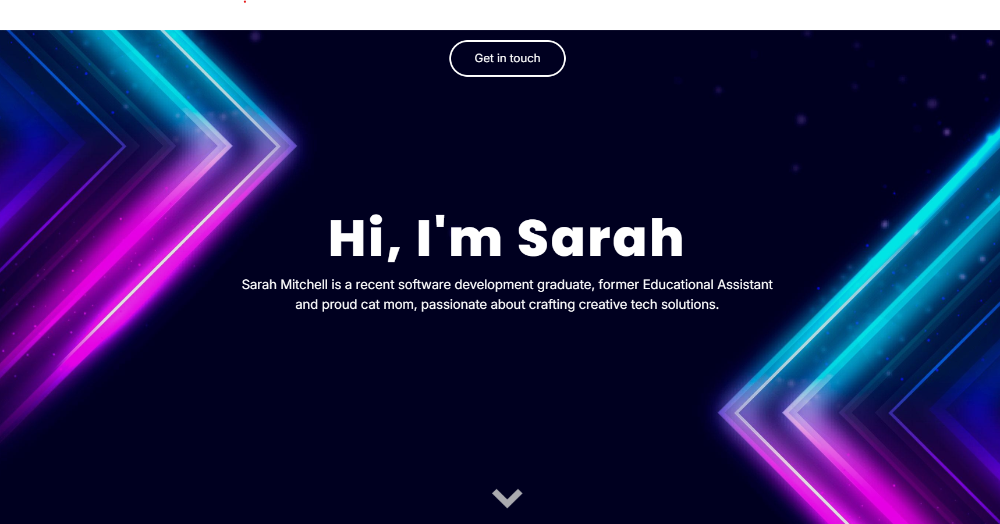

## Portfolio

This is my professional portfolio for my software development career, it is also the final project for Technical Writing Skills, for the Software Development program at Manitoba Institute of Trades and Technology.

### Examples
Some examples I used were [Malinda Lakshan's Porfolio](https://www.malindalakshan.com/), [Dev Khandelwal's Portfolio](https://slyro.vercel.app/) and [Andre Specht's Portfolio](https://andrespecht.dev/)

### Project Features
- Responsive Design: The layout is optimized for different screen sizes (desktop, tablet, mobile) to ensure accessibility and usability across devices.    

- GitHub Pages Hosting: The site is hosted on GitHub Pages, indicating it is a static site without server-side processing.  

- Infinite Scroll Animation: The "Proficiencies" section features an infinite scroll animation, showcasing various technologies and skills in a visually appealing manner. 

### Use Cases
- Job seekers can use it as a template for their own portfolios, adapting the infinite scroll to display personal skills and attract recruiters.
  
- Employers browsing the site on various devices can quickly assess my technical abilities through responsive layouts and animated elements.
  
- Students in similar programs might reference it for inspiration on structuring technical writing projects with visual flair.
  
### Technologies I Used
- HTML5
- CSS3
- JS
- Markdown
- Github Pages
- Google Fonts
- ES Modules and utlity functions

#@# Future Developments
- Add a projects gallery with interactive thumbnails and detailed case studies for deeper insights.
  
- Integrate a contact form with email functionality using JavaScript for direct inquiries.
  
- Incorporate dark mode toggle to improve user experience in low-light environments.
  
### Check it out [here](https://sarsbars.github.io/Portfolio-2.0/)
